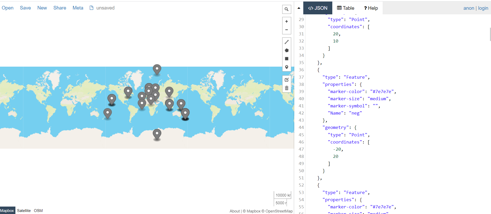

##Etude 7: Geojson Map Maker

######@Author Luka Didham

###Overview

This Program will read in a serires of lines from either command line or a plaintext file and attempt to convert
said line to a standard form coordinate. The program attempts to match as many various user inputs as possible
including non-standard coordinate formats such as DMS and accounting for varying Cardinal inputs. If the program
is successful in converting a line a "marker" will be created which represents one location successfully read.
If the program is unsuccessful in converting a line will print an error message "Unable to process: " followed
by the best fitting reason for the invalid entry.

This program is mainly based around the use of Regex statements attempting to be as inclusive as possible.
After all lines have been read in and markers created they will be written to a formatted geojson file "Map example".
We then with the newly written file go to https://geojson.io/#map=2/20.0/0.0 to visualise the markers on our map.

Once in geojson.io go open->file->Map example.geojson and you will see the formatted
file put the markers on the map. Figure below shows the result of running the test file
with the "testInputs" data set. Note that no values are bunched against the edges of the map suggesting
that the looping strategy discussed in comments worked well.

###Usage

To compile use the Kotlin compiler supported in most IDE's. Created and tested
in IntelliJ IDEA 2021.

To manually compile from the command line run
$ kotlinc GeoMapMaker.kt -include-runtime -d GeoMapMaker.jar
$ java -jar GeoMapMaker.jar

After the programs runs it will prompt you to select mode by entering an int 1-3...
1) Command line entry
2) Example inputs from brief
3) Exhaustive testing file

After the programs runs the text file "Map example.geojson" will be ready to be visualised.
The visualiser I used for testing was https://geojson.io/#map=2/20.0/0.0. Once in geojson.io go open->file->Map example.geojson and you will see the formatted
file put the markers on the map.

###Testing

Contained within the testInputs file we can see all test cases covering most combinations
of user possible inputs. All test cases contained within the file return successful results
and correctly placing the marker shown in the image above.
